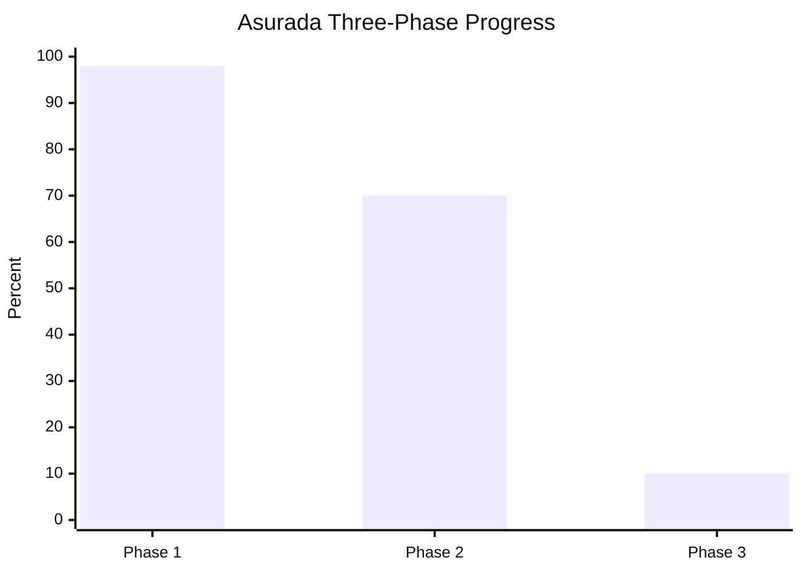
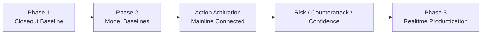

# Asurada 项目总进度看板

> 本页用于快速查看三个阶段的总进度、已完成项、停滞项和待开发项。  
> 详细实现状态以 [asurada-core/STATUS.md](asurada-core/STATUS.md) 为准。

## 总览

## 阶段一：核心开发闭环

进度条：`█████████▓ 98%`

### 已完成项

- 真实抓包 JSONL 回放输入
- CSV 单圈输入
- 高价值 packet 解析与标准化状态输出
- 分层策略引擎与调试 payload
- HTML debug dashboard
- `live UDP` 已接入完整主链，异常 `safety_car_status` 已容错，同码输出已做 suppress，日志已支持滚动切分
- `live` 与 `capture replay` 已切到共用运行主链
- 实时日志已补 `udp/decode/snapshot/strategy/output` 毫秒级阶段观测
- 顶层 `weather / safety_car / source_timestamp_ms / total_laps` 已回写到 `session_log`
- 离线调试面板已重做为单帧/短时回放检查页，前两分钟正赛窗口已验证可用
- 固定样本阶段一回归
- timing/gap 双轨收口：官方字段进主链，估算字段仅供 debug
- `Session` trailer、`LapPositions`、session type 分类等协议精修

### 停滞项

- `LobbyInfo` 真实联机样本验证
- 稀有 `Event` code` 的真实样本验证

### 待开发项

- 若阶段一重新打开，优先处理稀有事件样本和协议尾项
- 补剩余外部样本验证
- 增加一页式路线图图示

## 阶段二：模型与边缘化准备

进度条：`███████░░░ 70%`

### 已完成项

- 训练目录与数据集配置
- `features / labels / tactical_features_v1 / attack_features_v1 / strategy_action_features_v1` 导出
- `rear_threat_model` 第一版可用 baseline
- `fuel_risk_model / ers_risk_model / tyre_risk_model / dynamics_risk_model` 第一版可用 baseline
- `fuel_risk_model` 已按 `fuel_margin_laps` 主导口径重训，已去掉短赛程下的绝对油量误报
- `defence_cost_model` 第一版 proxy-distillation baseline，已旁路接入 runtime debug
- `rival_pressure_model` 第一版 baseline，已旁路接入 runtime debug
- `entry_quality_model / apex_quality_model / exit_traction_model` 第一版 baseline，已旁路接入 runtime debug
- `tyre_degradation_trend_model` 第一版 baseline，已旁路接入 runtime debug
- `attack_opportunity_model` 第一版可用 baseline
- `front_attack_commit_model` 第一版可接受 baseline
- `strategy_action_model` 第一版 baseline
- `strategy_arbiter_v2` 契约、主链接入与回归断言
- `confidence_model / uncertainty_layer` 最小规则版已接入主链
- `session_mode_router` 最小规则版已接入主链
- `fallback_policy` 最小独立模块已接入主链
- `tactical_state_machine` 最小规则版已接入主链，并带输出历史降抖
- 统一交互输入事件模型最小版
- 输出层可取消 / 可中断生命周期最小版
- `ASR -> query normalization -> strategy -> TTS` 分层日志骨架
- 结构化语音查询 schema 与指令路由接口
- 语音确认 / 权限分级规则
- 工具与长任务取消接口最小版
- exported `val/test` 切分已用于攻击链和动作模型
- 新增扩展训练样本接入：
  - `suzuka_sprint_race_like_uid15`
  - `shanghai_feature_race_like_uid16_20lap`
- `track_id 13 -> Suzuka` 赛道映射已补齐
- `Suzuka` 赛道语义模型已接入 `track_profile` 加载链
- `phase2_dataset_v2_extended` 扩展数据集配置与合并 metadata 已建立
- 本地扩展数据集整理工作流已落地：
  - `prepare_local_extended_dataset.py`
  - `validate_local_extended_dataset.py`
  - 本地交接文档已写入 `tmp/local_extended_dataset_workflow.md`
- `pit_window_support_model` 第一版已实现
  - 已输出 `lap_life_remaining_est / pit_window_open_prob / compound_risk_score / rejoin_traffic_penalty / estimated_rejoin_position_loss / undercut_defence_score`
  - 已写入 `decision.debug` 与 `arbiter_v2.input`
- `long_horizon_strategy_baseline` 第一版已实现
  - 已输出 `recommended_pit_lap / pit_window_start_lap / pit_window_end_lap / recommended_compound / recommended_set_index / recommended_set_available / strategy_confidence / aggression_bias`
  - 已轻度接入 `arbiter_v2`
- 长周期回归断言已补齐
  - `analyze_long_horizon_contract()` 已覆盖结构合法性与 `recommended_set_index / recommended_set_available` 一致性
- `strategy_action_model` 在扩展数据集下的 exported `val` 切分已修复，`DEFEND_WINDOW` 已稳定进入 `val`
- `attack_opportunity_model` 已按扩展数据集重做 exported `val`、收紧伪标签并改成保守阈值选择，当前误报已显著压低

### 停滞项

- `yield_vs_defend_model`
  - 原因：后验标签与攻防样本仍不稳定
- `event_impact_model`
  - 原因：事件样本量不足，泛化不稳定
- `counterattack_window_model`
  - 原因：当前专题样本正类几乎为空，`train=1 / val=1 / test=0`，继续训练只会得到假模型
- `short_horizon_risk_forecast_model`
  - 原因：未来风险标签定义过粗，当前快照特征不足以支撑短时风险演化预测，baseline 不成立
- `driver_style_model`
  - 原因：长窗口样本过少，风格标签塌缩，baseline 不成立
- `pit_rejoin_traffic_model`
  - 原因：`pit_status` 与状态转移字段已补齐，但 `pit_exit + rejoin_window` 候选样本仅 `11` 条，且交通分布只有 `light`

### 待开发项

- 长周期策略回放复核与口径标定
  - 重点：`recommended_compound / recommended_set_index / recommended_set_available` 在多赛道样本上的稳定性
- 长周期约束继续增强
  - 重点：`recommended_set_available = false` 时的更强仲裁约束、湿地 `TyreSets` set 级选择
- `yield_vs_defend_model` 重启前的数据/标签收口
- `event_impact_model` 事件样本补强
- 资源/压力/趋势 sidecar 分数有限度接入仲裁
- 攻防链 DRS / closing-rate 信号进一步增强
- 扩展数据集下 `rear_threat / front_attack_commit / strategy_action` 全链复核
- 本地扩展数据集工作流的 full export 长跑验收

### 当前新增控制层进展

- `fallback_policy`
  - 已完成最小独立模块，并接入 `StrategyEngine -> strategy_arbiter_v2`
  - 当前负责统一生成 `fallback_context / output_control`
- `tactical_state_machine`
  - 已完成最小规则版，并接入 `StrategyEngine`
  - 当前负责生成 `previous/current tactical_state`、`state_transition`、`state_priority_hint`、`state_lock`
  - 当前已按 `session_uid` 记住上一帧战术态和上一条主动作，用于降抖

### 当前边界

- `rival_pressure_model`
  - 当前只有 `rear_pressure` 分支稳定；`front_pressure` 和 aggregate `rival_pressure` 仍受前车压迫样本不足限制，只适合 sidecar 观察，不接主链
- `entry_quality_model / apex_quality_model / exit_traction_model`
  - 当前仍是 `proxy_distillation_from_features` baseline，更适合作趋势/观察分数，不是最终精细驾驶评分

## 阶段三：产品化与平台化

进度条：`█░░░░░░░░░ 10%`

### 已完成项

- 统一下行语音输出主线
- `SpeechJob` 统一语音任务模型
- `SpeechBackend / MacOSSayBackend` 真实播报 backend
- `ConsoleVoiceOutput` 已演进为统一输出协调器，并保持 `emit(decision, render=...)` 入口不变
- `1 active + 1 pending` 语音队列
- `enqueue / replace_pending / complete` 生命周期
- 系统主动播报与结构化查询响应共用同一条输出链
- `AudioIO / VAD / VoiceTurn` 输入基础模块
- `FastIntentASR / voice_nlu / voice_input` 结构化双向语音输入骨架
- `conversation_context / semantic_normalizer / response_composer` 语义归一化、短上下文记忆与规则化解释层
- `open_fallback` 与更广语义问法已落地，已覆盖前后车、DRS、ERS、车损、进站、天气、处罚、整体形势、轮胎 outlook 等问法
- `PiperBackend` 设备侧 TTS backend 代码路径已落地
- 阶段三语音回归脚本
- 阶段三语音模块架构文档
- 阶段三语音模块实施计划

### 停滞项

- 暂无。本阶段当前已进入“输出主线 + 输入基础 + 语义层”并行推进，但设备侧闭环仍未开始。

### 待开发项

- 真实麦克风 / 设备侧 `AudioIO` backend 与声学输入 front-end
- `OpenASR` fallback 与 transcript arbiter
- 控制命令、watchdog、降级与恢复机制的正式设备侧闭环
- Pi 5 / CM5 / 边缘设备 `PiperBackend` 真机验证
- 查询触发入口产品化
- Pi 5 / CM5 部署与延迟优化
- 产品级 HUD / 语音 / 控制台整合

## 当前重点

## 参考文档

- [asurada-core/STATUS.md](asurada-core/STATUS.md)
- [asurada-core/PHASE1_CLOSEOUT.md](asurada-core/PHASE1_CLOSEOUT.md)
- [asurada-core/PHASE2_MODEL_MATRIX_CN.md](asurada-core/PHASE2_MODEL_MATRIX_CN.md)
- [asurada-core/README.md](asurada-core/README.md)
