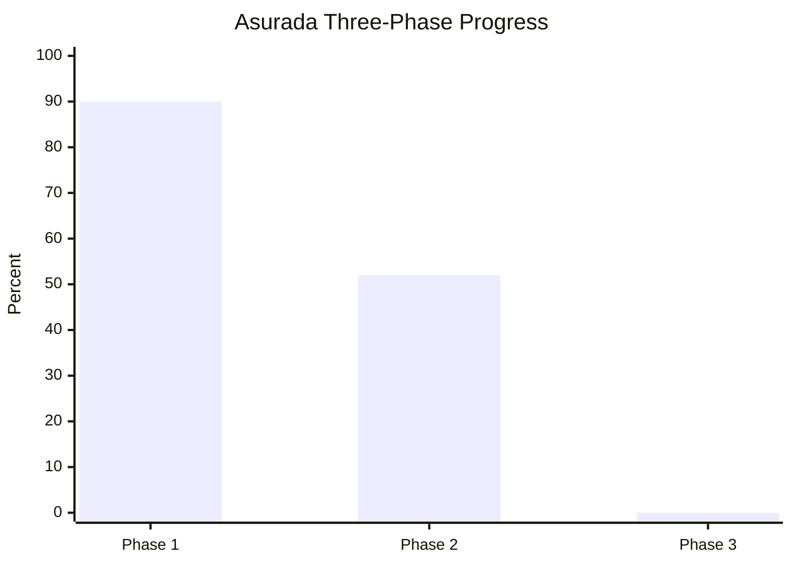
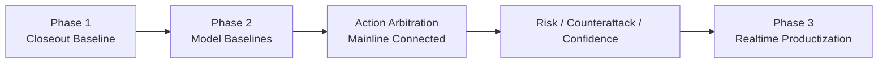

# Asurada 项目总进度看板

> 本页用于快速查看三个阶段的总进度、已完成项、停滞项和待开发项。  
> 详细实现状态以 [asurada-core/STATUS.md](asurada-core/STATUS.md) 为准。

## 总览

## 阶段一：核心开发闭环

进度条：`█████████░ 90%`

### 已完成项

- 真实抓包 JSONL 回放输入
- CSV 单圈输入
- 高价值 packet 解析与标准化状态输出
- 分层策略引擎与调试 payload
- HTML debug dashboard
- 固定样本阶段一回归
- timing/gap 双轨收口：官方字段进主链，估算字段仅供 debug
- `Session` trailer、`LapPositions`、session type 分类等协议精修

### 停滞项

- `live UDP` 完整实时闭环
- `live` 与 `capture replay` 完全共路径
- `LobbyInfo` 真实联机样本验证
- 稀有 `Event` code` 的真实样本验证

### 待开发项

- 若阶段一重新打开，优先处理实时链
- 补剩余外部样本验证
- 增加一页式路线图图示

## 阶段二：模型与边缘化准备

进度条：`██████░░░░ 58%`

### 已完成项

- 训练目录与数据集配置
- `features / labels / tactical_features_v1 / attack_features_v1 / strategy_action_features_v1` 导出
- `rear_threat_model` 第一版可用 baseline
- `fuel_risk_model / ers_risk_model / tyre_risk_model / dynamics_risk_model` 第一版可用 baseline
- `fuel_risk_model` 已按 `fuel_margin_laps` 主导口径重训，已去掉短赛程下的绝对油量误报
- `defence_cost_model` 第一版 proxy-distillation baseline，已旁路接入 runtime debug
- `rival_pressure_model` 第一版 baseline，已旁路接入 runtime debug
- `entry_quality_model / apex_quality_model / exit_traction_model` 第一版 baseline，已旁路接入 runtime debug
- `tyre_degradation_trend_model` 第一版 baseline，已旁路接入 runtime debug
- `attack_opportunity_model` 第一版可用 baseline
- `front_attack_commit_model` 第一版可接受 baseline
- `strategy_action_model` 第一版 baseline
- `strategy_arbiter_v2` 契约、主链接入与回归断言
- `confidence_model / uncertainty_layer` 最小规则版已接入主链
- `session_mode_router` 最小规则版已接入主链
- 统一交互输入事件模型最小版
- 输出层可取消 / 可中断生命周期最小版
- exported `val/test` 切分已用于攻击链和动作模型

### 停滞项

- `yield_vs_defend_model`
  - 原因：后验标签与攻防样本仍不稳定
- `event_impact_model`
  - 原因：事件样本量不足，泛化不稳定
- `counterattack_window_model`
  - 原因：当前专题样本正类几乎为空，`train=1 / val=1 / test=0`，继续训练只会得到假模型
- `short_horizon_risk_forecast_model`
  - 原因：未来风险标签定义过粗，当前快照特征不足以支撑短时风险演化预测，baseline 不成立

### 待开发项

- 语音确认 / 权限分级规则
- `ASR -> query normalization -> strategy -> TTS` 分层日志骨架
- 结构化语音查询 schema 与指令路由接口
- 攻防链 DRS / closing-rate 信号进一步增强

### 当前新增控制层进展

- `fallback_policy`
  - 已完成最小独立模块，并接入 `StrategyEngine -> strategy_arbiter_v2`
  - 当前负责统一生成 `fallback_context / output_control`
- `tactical_state_machine`
  - 已完成最小规则版，并接入 `StrategyEngine`
  - 当前负责生成 `previous/current tactical_state`、`state_transition`、`state_priority_hint`、`state_lock`

### 当前边界

- `rival_pressure_model`
  - 当前只有 `rear_pressure` 分支稳定；`front_pressure` 和 aggregate `rival_pressure` 仍受前车压迫样本不足限制，只适合 sidecar 观察，不接主链
- `entry_quality_model / apex_quality_model / exit_traction_model`
  - 当前仍是 `proxy_distillation_from_features` baseline，更适合作趋势/观察分数，不是最终精细驾驶评分

## 阶段三：产品化与平台化

进度条：`░░░░░░░░░░ 0%`

### 已完成项

- 暂无

### 停滞项

- 暂无。该阶段尚未正式启动。

### 待开发项

- 实时 UDP 完整主链
- 模型本地推理链
- Pi 5 / CM5 部署与延迟优化
- 双向语音正式链路
- 降级与 watchdog 机制
- 产品级 HUD / 语音 / 控制台整合

## 当前重点

## 参考文档

- [asurada-core/STATUS.md](asurada-core/STATUS.md)
- [asurada-core/PHASE1_CLOSEOUT.md](asurada-core/PHASE1_CLOSEOUT.md)
- [asurada-core/PHASE2_MODEL_MATRIX_CN.md](asurada-core/PHASE2_MODEL_MATRIX_CN.md)
- [asurada-core/README.md](asurada-core/README.md)
