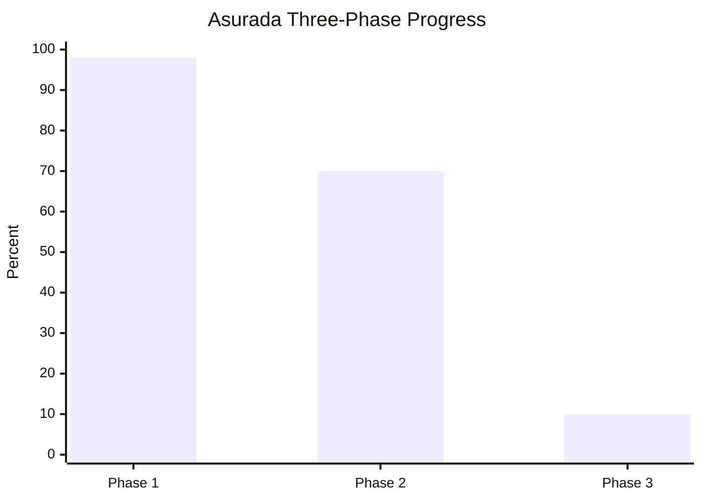
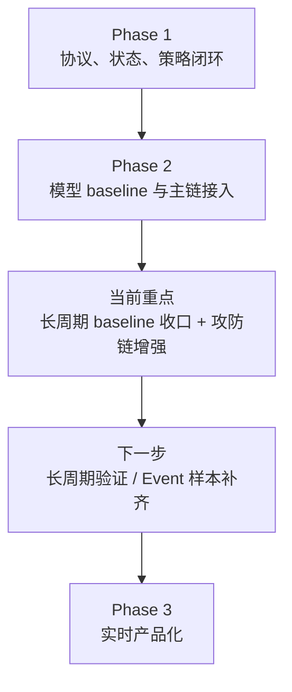

# Asurada

赛车策略大脑项目工作区。根目录只做两件事：
- 展示当前项目进度
- 给出最直接的阅读和开发入口

## 项目进度




## 当前状态



- 阶段一：基本完成，`live UDP` 与 `capture replay` 已共用运行主链，实时日志已补毫秒级阶段观测，顶层天气/时间戳已回写，离线调试面板已按单帧与短时回放重做，当前主要剩外部样本验证和少量协议收口
- 阶段二：进行中，已完成第一批可用 baseline、控制层主链接口，并扩展到趋势模型 runtime sidecar；新日本站样本已拆分接入训练链，攻击链与动作模型的 exported `val` 已补齐并收口，本地扩展数据集整理入口、校验脚本和交接文档已落地，`fallback_policy` 与 `tactical_state_machine` 已接主链，`pit_window_support_model + long_horizon_strategy_baseline` 第一版已实现并轻度接入 `arbiter_v2`，`counterattack_window_model / short_horizon_risk_forecast_model / driver_style_model / pit_rejoin_traffic_model` 当前处于样本或标签阻塞状态
- 阶段三：已启动输出侧基础，统一下行语音输出主线已接 `MacOS say`，系统主动播报与结构化查询响应已共路径；阶段三语音模块架构与实施计划已完成，ASR、双向闭环、设备侧部署仍未开始

详细看板：
- [PROJECT_PROGRESS.md](PROJECT_PROGRESS.md)

## 从这里开始

### 我想看项目现在做到哪了

- [PROJECT_PROGRESS.md](PROJECT_PROGRESS.md)
- [asurada-core/STATUS.md](asurada-core/STATUS.md)

### 我想看核心技术工作流

- [asurada-core/doc/README.md](asurada-core/doc/README.md)
- [asurada-core/CORE_WORKFLOW_CN.md](asurada-core/CORE_WORKFLOW_CN.md)
- [asurada-core/ARCHITECTURE.md](asurada-core/ARCHITECTURE.md)

### 我想看阶段二模型和主链

- [asurada-core/PHASE2_MODEL_MATRIX_CN.md](asurada-core/PHASE2_MODEL_MATRIX_CN.md)
- [asurada-core/PHASE2_DEBUG_DASHBOARD_CN.md](asurada-core/PHASE2_DEBUG_DASHBOARD_CN.md)
- [asurada-core/training/README.md](asurada-core/training/README.md)

### 我想看当前运行调试页

- [asurada-core/runtime_logs/dashboard/debug_dashboard.html](asurada-core/runtime_logs/dashboard/debug_dashboard.html)

### 我想直接进后端工程

- [asurada-core/README.md](asurada-core/README.md)

## 工作区结构

```text
Asurada/
├── asurada-core/              后端策略脑工作区（当前主要代码）
├── ios-racetrack-analytics/   App 工作区（本地目录，默认未纳入当前提交历史）
├── tools/                     抓包、脚本与外部数据（本地目录）
├── doc/                       导出文档与资料（本地目录）
├── tmp/                       本地临时文件
└── .derived-data/             本机构建产物
```

## 当前版本管理范围

当前仓库已稳定纳入版本管理的主体是：
- [asurada-core](asurada-core)

其余顶层目录当前主要作为本地工作区存在，默认不作为已提交历史的一部分。

## 后端快速开始

```bash
cd /Users/sn5/Asurada/asurada-core
source .venv/bin/activate

python main.py --demo
python main.py --csv /Users/sn5/asurada_simulator/tools/f1_recorder/data/20260319_015115_shanghai_lap.csv
python main.py --capture-jsonl /Users/sn5/Asurada/tools/captures/f1_25_udp_capture_20260321_024707.jsonl
python main.py --build-dashboard
```

## 说明

- 根目录 `.gitignore` 只忽略本机和临时产物
- `asurada-core/.gitignore` 负责后端工程自身忽略规则
- 大体积抓包和导出产物默认不提交，只跟踪必要 metadata 或文档
