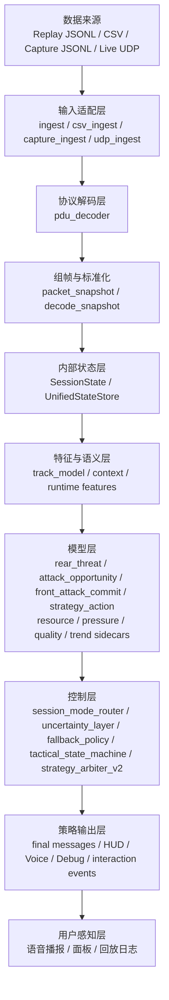
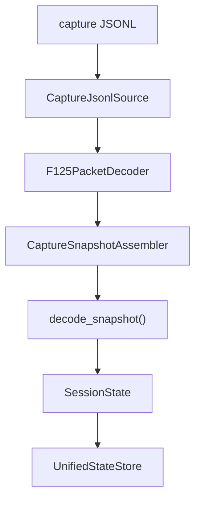
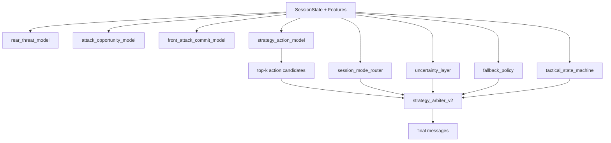
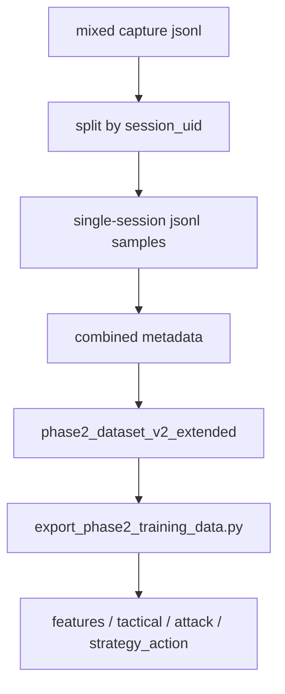
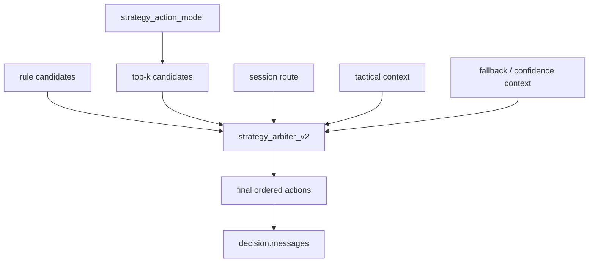
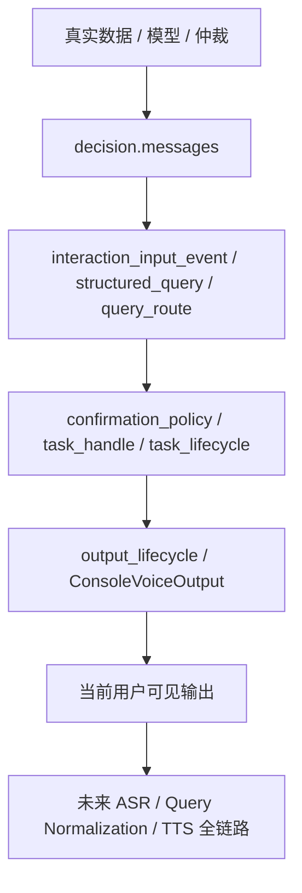
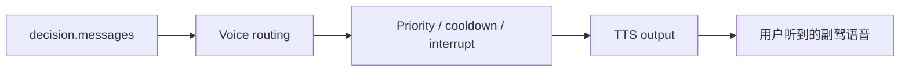

# Asurada 核心工作流与技术原理

> 这份文档用于串起项目核心主线：  
> 数据来源 -> 数据走向 -> 模型输入 -> 模型决策 -> 仲裁 -> 输出到用户。  
> 适合作为快速理解系统主流程的入口文档。

## 1. 一页总览

## 2. 数据来源

当前核心数据来源有四类：

1. `Replay JSONL`
   - 已标准化回放数据
   - 主要用于快速 demo 和开发验证
2. `Single-Lap CSV`
   - 单圈分析原型路径
   - 不包含完整多车比赛语义
3. `Captured UDP JSONL`
   - 真实 F1 25 抓包回放
   - 当前最重要的真实数据主线
4. `Live UDP`
   - 实时 UDP 监听壳
   - 当前尚未打通完整主链

当前训练样本侧还新增了一类来源：

5. `Split Session JSONL`
   - 从单个混合抓包大文件中按 `session_uid` 拆出的单 session 样本
   - 当前已用于 `phase2_dataset_v2_extended`
   - 例子：
     - `suzuka_sprint_race_like_uid15`
     - `shanghai_feature_race_like_uid16_20lap`

对应代码：

- [src/asurada/ingest.py](src/asurada/ingest.py)
- [src/asurada/csv_ingest.py](src/asurada/csv_ingest.py)
- [src/asurada/capture_ingest.py](src/asurada/capture_ingest.py)
- [src/asurada/udp_ingest.py](src/asurada/udp_ingest.py)

## 3. 数据走向

### 3.1 真实抓包主线

### 3.2 每一层做什么

#### 输入层

- `capture_ingest.py`
  - 逐条读取抓包 JSONL
  - 还原原始 UDP payload

#### 解码层

- `pdu_decoder.py`
  - 解 F1 25 包头
  - 按 `packet_id` 分发正文解码
  - 产出结构化 packet body

#### 组帧层

- `packet_snapshot.py`
  - 按 `session_uid + frame_identifier` 组帧
  - 合并多种 packet
  - 生成统一 snapshot
  - 同时保留 `raw` 字段和协议来源信息

#### 状态转换层

- `decode.py`
  - 把 snapshot dict 转成内部 dataclass
  - 产出 `SessionState`

#### 状态仓

- `state.py`
  - 维护 `latest`
  - 维护短窗口历史
  - 供风险、模型、策略和回放共同使用

## 4. 模型输入来自哪里

模型输入不直接吃原始 UDP，而是吃已经整理好的稳定字段。

输入来源主要有三层：

1. `SessionState`
   - 当前帧核心状态
2. `raw`
   - 保留的协议级字段
3. `短窗口与赛道语义派生`
   - closing-rate
   - next segment
   - tactical context

最权威的字段定义：

- [STAGE2_MODEL_INPUT_SCHEMA.md](STAGE2_MODEL_INPUT_SCHEMA.md)
- [PARSED_FIELDS_AND_MODEL_USAGE_CN.md](PARSED_FIELDS_AND_MODEL_USAGE_CN.md)
- [PHASE2_MODEL_MATRIX_CN.md](PHASE2_MODEL_MATRIX_CN.md)

### 当前高价值输入字段示例

#### timing / gap

- `official_gap_ahead_s`
- `official_gap_behind_s`
- `timing_mode`
- `timing_support_level`
- `gap_confidence_*`

#### 资源

- `fuel_laps_remaining`
- `ers_pct`
- `drs_available`
- `tyre.wear_pct`
- `tyre.age_laps`

#### 动态

- `speed_kph`
- `throttle`
- `brake`
- `steer`
- `g_force_longitudinal`
- `wheel_slip_ratio`
- `recent_unstable_ratio`

#### 对手与赛道语义

- `rear_rival_speed_delta`
- `front_rival_speed_delta`
- `track_segment`
- `track_usage`
- `next_track_segment`
- `next_two_segments`

## 5. 当前哪些模型参与决策

### 已接入主链或直接影响主链的模型/模块

当前实际参与决策的关键对象：

- `rear_threat_model`
  - 后车威胁判断
- `attack_opportunity_model`
  - 攻击机会判断
- `front_attack_commit_model`
  - 是否值得真正投入进攻
- `strategy_action_model`
  - 高频动作子集的 `top-k` 候选输出
- `strategy_arbiter_v2`
  - 统一仲裁规则候选和模型候选
- `session_mode_router`
  - 按排位 / 冲刺 / 正赛过滤动作与模型候选
- `confidence_model / uncertainty_layer`
  - 生成 `confidence_context / fallback_context`
- `fallback_policy`
  - 低置信度、非 timing 场景、战术锁定时提供真实回退策略
- `tactical_state_machine`
  - 维护 `previous/current tactical_state`、`state_transition` 与状态保持

### 已试跑但当前未参与主链的模型

- `yield_vs_defend_model`
  - 当前暂停
- `event_impact_model`
  - 当前暂停

### 已接入 runtime debug、暂未进主链的 sidecar 模型

- `fuel_risk_model`
- `ers_risk_model`
- `tyre_risk_model`
- `dynamics_risk_model`
- `defence_cost_model`
- `rival_pressure_model`
- `entry_quality_model`
- `apex_quality_model`
- `exit_traction_model`
- `tyre_degradation_trend_model`

### 当前已阻塞或暂停的模型

- `yield_vs_defend_model`
- `event_impact_model`
- `counterattack_window_model`
- `short_horizon_risk_forecast_model`
- `driver_style_model`
- `pit_rejoin_traffic_model`

## 6. 模型是怎么决策的

### 6.1 当前不是“大模型一句话出答案”

当前系统不是单模型直接产出最终建议，而是：

1. 多个模型先分别给出分数或候选
2. `strategy_action_model` 负责给出 `top-k` 动作候选
3. 控制层先给出：
   - `session_route`
   - `confidence_context`
   - `fallback_context`
   - `tactical_state`
4. `strategy_arbiter_v2` 统一仲裁
5. 最终生成 `decision.messages`

### 6.3 当前训练链新增扩展样本入口

阶段二当前已支持把新的混合抓包拆成可训练样本后并入训练链：

当前已验证：

- 新样本拆分后可进入现有导出链
- `strategy_action_model` 的 exported `val` 已在扩展数据集下修复
- `attack_opportunity_model` 已按扩展数据集完成 `val` 切分、标签收紧和保守阈值收口

### 6.2 为什么是 `top-k + 仲裁`

原因：

- `top-1` 单独直出不够稳
- 当前 `strategy_action_model` 的 `top2` 远强于 `top1`
- 比赛场景天然需要：
  - 战术状态
  - 回退策略
  - cooldown
  - 规则链兜底

所以当前更合理的结构是：

## 7. 模型输出是什么

### 模型层输出

当前模型典型输出包括：

- `rear_threat_score`
- `attack_opportunity_score`
- `attack_commit_score`
- `action_candidates`
- `action_priority_scores`

### 仲裁层输出

`strategy_arbiter_v2` 输出：

- `final_hud_action`
- `final_voice_action`
- `final_strategy_stack`
- `suppressed_actions`
- `ordered_actions`

### 主链最终输出

主链最终交给外部消费的是：

- `decision.messages`

这里的每条消息当前包含：

- `code`
- `title`
- `detail`
- `priority`

## 8. 到语音流给用户的这条线

当前完整生产级双向语音还没做完，但阶段三防返工接口已经补到位。

### 当前已完成

- 模型和仲裁结果已经能进入 `decision.messages`
- `output.py` 可以消费这些策略消息
- debug payload 可以把模型候选、仲裁结果和最终消息展示出来
- 统一交互输入事件模型已存在：
  - `interaction_session_id`
  - `turn_id`
  - `request_id`
  - `snapshot_binding_id`
- 输出层已具备最小生命周期：
  - `start / interrupt / suppress / cancel / idle`
- 分层日志骨架已存在：
  - `asr`
  - `query_normalization`
  - `strategy`
  - `tts`

### 后续完整语音链

后续完整语音链会是：

未来双向语音还会增加：

- ASR
- intent routing
- structured query handling
- explanation layer

对应规划文档：

- [REALTIME_VOICE_AND_MODEL_ARCHITECTURE_CN.md](REALTIME_VOICE_AND_MODEL_ARCHITECTURE_CN.md)

## 9. 当前系统的关键边界

### 已成立

- 真实抓包 -> 状态 -> 模型 -> 仲裁 -> 最终消息，这条线已成立
- `session_mode_router / uncertainty_layer / fallback_policy / tactical_state_machine / strategy_arbiter_v2` 已接主链
- `strategy_action_model` 已作为真实 `top-k` 候选提供器参与主链
- 资源/压力/驾驶质量/趋势模型已能作为 runtime sidecar 观察分数

### 还没完全成立

- 完整实时 UDP 主链
- 完整防守/失守/反击闭环
- 完整生产级语音链
- 真实 ASR / query normalization / TTS 执行层

## 10. 建议阅读顺序

如果你要快速理解项目核心工作流，按这个顺序看：

1. [ARCHITECTURE.md](ARCHITECTURE.md)
2. [CORE_WORKFLOW_CN.md](CORE_WORKFLOW_CN.md)
3. [STAGE2_MODEL_INPUT_SCHEMA.md](STAGE2_MODEL_INPUT_SCHEMA.md)
4. [PHASE2_MODEL_MATRIX_CN.md](PHASE2_MODEL_MATRIX_CN.md)
5. [PHASE2_DEBUG_DASHBOARD_CN.md](PHASE2_DEBUG_DASHBOARD_CN.md)
6. [REALTIME_VOICE_AND_MODEL_ARCHITECTURE_CN.md](REALTIME_VOICE_AND_MODEL_ARCHITECTURE_CN.md)
