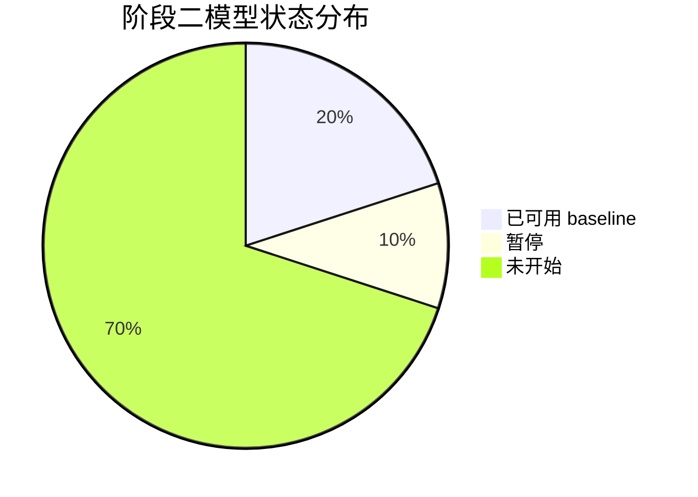
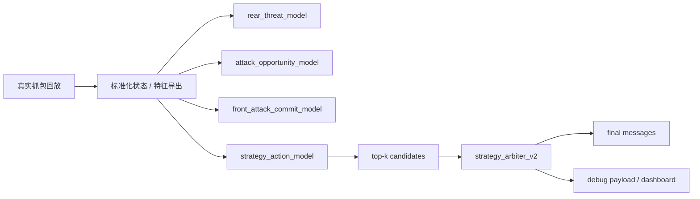
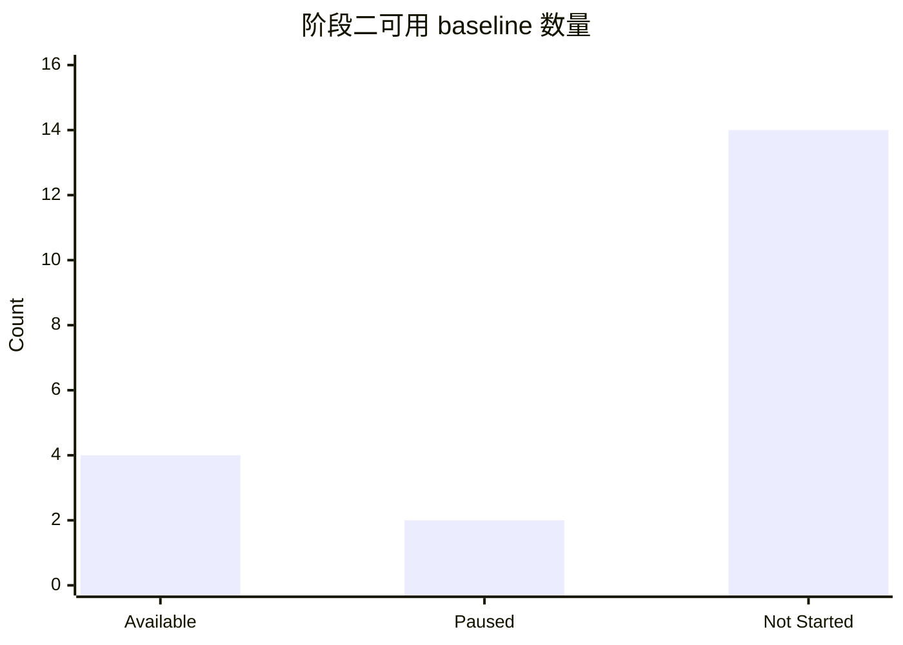
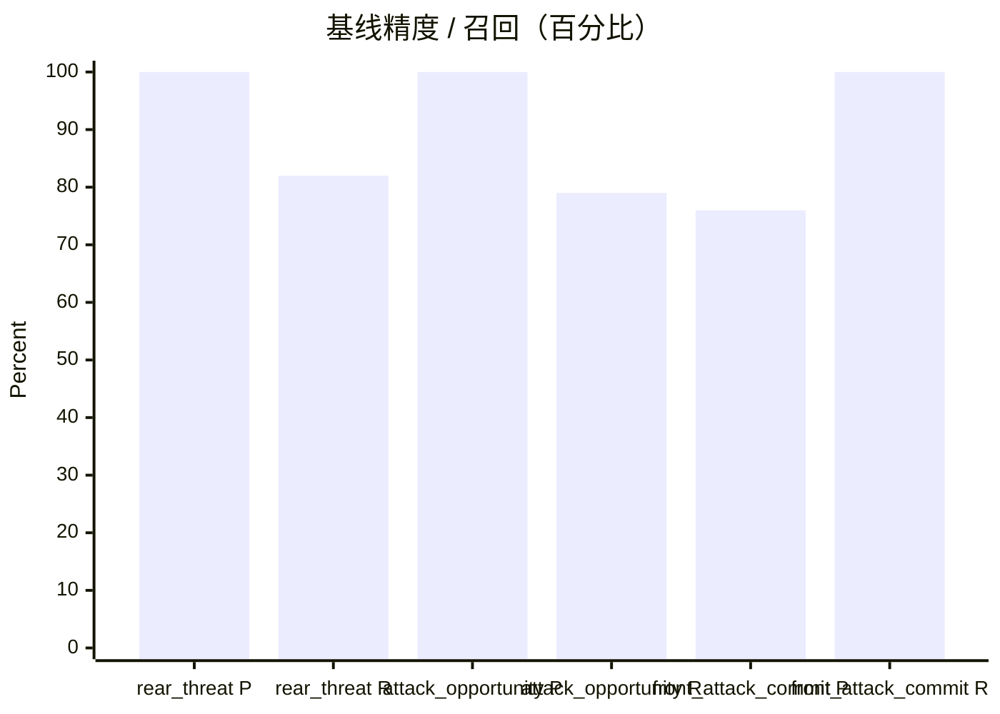
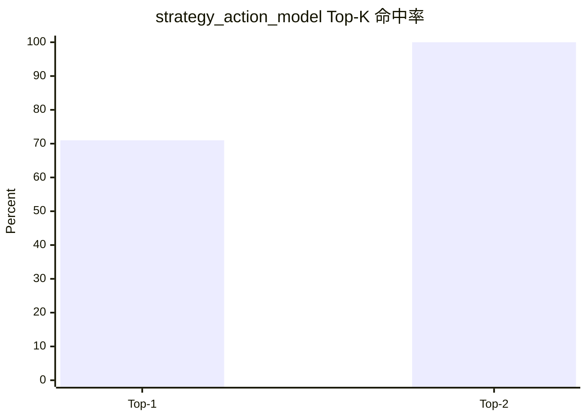
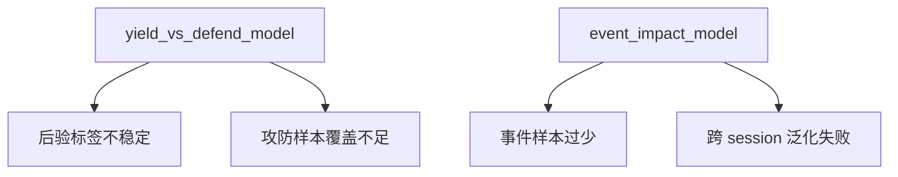
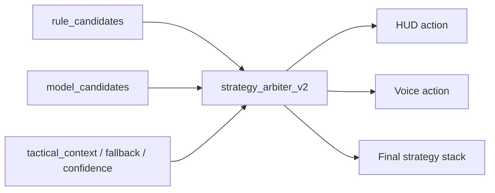
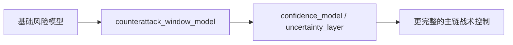

# 阶段二调试看板

> 这是一个适合 GitHub 展示的阶段二静态调试看板。  
> 目标是把当前模型基线、主链接入状态和停滞项，以图表方式直接展示在仓库里。  
> 详细状态仍以 [STATUS.md](STATUS.md) 和 [PHASE2_MODEL_MATRIX_CN.md](PHASE2_MODEL_MATRIX_CN.md) 为准。

## 当前状态总览

## 当前主链

## 已可用 baseline

| 模型 | 当前状态 | 说明 |
| --- | --- | --- |
| `rear_threat_model` | 可用 | 后车威胁识别第一版已成立 |
| `attack_opportunity_model` | 可用 | 已具备 exported `val/test` |
| `front_attack_commit_model` | 可接受 | 已具备 exported `val/test`，后续仍需继续收紧标签 |
| `strategy_action_model` | 可用 | 当前更适合作为 `top-k` 候选提供器 |

## 基线指标

### `rear_threat_model`

- `accuracy = 97.99%`
- `positive precision = 100.00%`
- `positive recall = 81.82%`

### `attack_opportunity_model`

- `accuracy = 99.94%`
- `positive precision = 100.00%`
- `positive recall = 79.31%`

### `front_attack_commit_model`

- `accuracy = 99.96%`
- `positive precision = 76.47%`
- `positive recall = 100.00%`

### `strategy_action_model`

- `top1_accuracy = 70.52%`
- `top2_accuracy = 99.98%`
- 当前覆盖动作：
  - `NONE`
  - `LOW_FUEL`
  - `DEFEND_WINDOW`
  - `DYNAMICS_UNSTABLE`

## 当前停滞项

| 模型 | 当前状态 | 停滞原因 |
| --- | --- | --- |
| `yield_vs_defend_model` | 暂停 | 后验标签和攻防专题样本仍不稳定 |
| `event_impact_model` | 暂停 | 事件样本量不足，收紧后又过小，无法稳定泛化 |

## 已接入主链的控制模块

### `strategy_arbiter_v2`

- 已真实消费 `strategy_action_model top-k`
- 已接管最终 `messages` 排序
- 已加入 priority 校准
- 已接入自动回归断言：
  - `priority_floor_calibrated`
  - `cooldown_suppresses_last_action`
  - `duplicate_codes_deduped`

## 待开发项

### 上游基础模型

- `fuel_risk_model`
- `ers_risk_model`
- `tyre_risk_model`
- `dynamics_risk_model`
- `defence_cost_model`

### 攻防与对手模型

- `counterattack_window_model`
- `rival_pressure_model`

### 驾驶质量模型

- `entry_quality_model`
- `apex_quality_model`
- `exit_traction_model`

### 趋势与长期模型

- `tyre_degradation_trend_model`
- `short_horizon_risk_forecast_model`
- `driver_style_model`
- `pit_rejoin_traffic_model`

## 下一步建议

当前最合理的顺序：

1. 补 `fuel / ers / tyre / dynamics` 风险模型
2. 再补 `counterattack_window_model`
3. 再实现 `confidence_model / uncertainty_layer`

## 参考文档

- [STATUS.md](STATUS.md)
- [PHASE2_MODEL_MATRIX_CN.md](PHASE2_MODEL_MATRIX_CN.md)
- [training/README.md](training/README.md)
