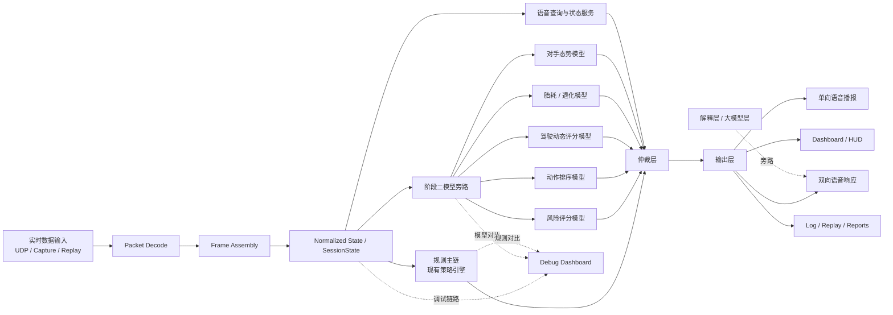
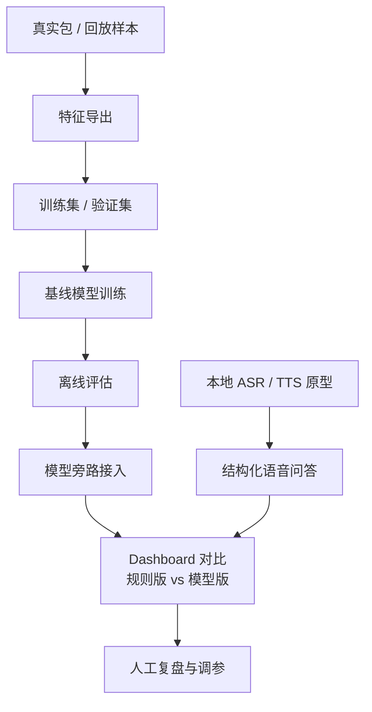
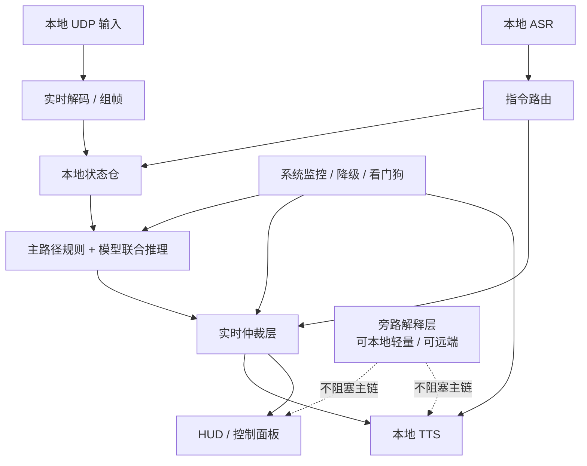
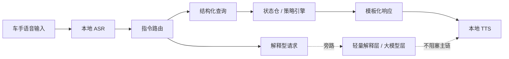

# 实时语音与模型架构图

## 文档用途

这份文档用于明确：

- 阶段二和阶段三的边界
- 模型系统应该如何分层
- 哪些能力必须本地部署
- 双向语音如何保证实时性

本文档不是算法细节文档，而是工程实施图。

当前仓库位置：

- 阶段三语音模块已经完成统一下行语音输出主线
- `AudioIO / VAD / VoiceTurn / FastIntentASR / voice_nlu / voice_input` 输入基础已经落地
- 语义归一化、短上下文记忆、规则化解释层与 `open_fallback` 已落地
- 更广语义问法已覆盖前后车、DRS、ERS、进站、天气、处罚、车损、整体形势与轮胎 outlook
- 仍未完成真实麦克风 / 设备侧音频 backend、`OpenASR` fallback、watchdog 与 Pi 5 / CM5 真机闭环

---

## 一、阶段二 / 阶段三边界

### 阶段二：模型研发与旁路接入阶段

阶段二的目标不是直接做成最终产品，而是把“模型能力”建立起来，并安全接入现有策略脑。

阶段二目标能力：

- 特征导出管线
- 标签生成管线
- 训练集 / 验证集组织
- 基线模型训练
- 模型离线评估
- 模型旁路推理接入
- dashboard 上的规则版 / 模型版对比
- 本地 ASR / TTS 原型
- 双向语音原型
- 结构化语音问答原型
- 统一交互输入事件模型
- `turn_id / interaction_session_id / request_id` 轮次标识
- 策略查询与状态快照绑定协议
- 输出层可取消 / 可中断生命周期
- 语音确认 / 权限分级规则
- `ASR -> query normalization -> strategy -> TTS` 分层日志骨架

阶段二当前已完成：

- 特征导出、标签导出、训练集组织的主干链路
- 第一批 baseline 模型训练与离线评估
- 模型旁路推理接入
- dashboard 上的规则版 / 模型版对比
- `strategy_arbiter_v2 / uncertainty_layer / session_mode_router` 主链接口骨架
- 状态标准化、短窗口状态仓、回放与调试日志主干
- 统一交互输入事件模型最小版
- `turn_id / interaction_session_id / request_id` 最小版
- 策略查询与状态快照绑定协议最小版
- 输出层可取消 / 可中断生命周期最小版
- `ASR -> query normalization -> strategy -> TTS` 分层日志骨架最小版
- 结构化语音查询 schema 与指令路由接口最小版
- 语音确认 / 权限分级规则最小版
- 工具与长任务取消接口最小版

阶段二接口预埋之后，由阶段三继续承接的项：

- 真实麦克风 / 设备侧 `AudioIO` backend
- 设备侧 `TTS` backend 真机验证
- `OpenASR` fallback 与 transcript arbiter
- 语音确认 / 权限分级规则的正式扩展
- 工具与长任务取消接口的正式扩展
- `ASR -> query normalization -> strategy -> TTS` 分层日志骨架的正式扩展
- 结构化语音查询 schema 与指令路由接口的正式扩展

阶段二的核心特点：

- 模型可以参与判断，但不直接替代全部主链
- 规则引擎仍然保留主控权
- 解释层和大模型层保持旁路
- 主要目标是“模型有效、可验证、可解释”
- 阶段三会用到的交互接口、状态接口、取消接口必须在阶段二先定型

### 阶段三：产品化与实时主链部署阶段

阶段三的目标是把阶段二验证过的能力，压缩成真正可交付、可部署、可持续运行的系统。

阶段三完成内容：

- Pi 5 / CM5 部署
- 本地模型推理优化
- 模型压缩与格式转换
- 主路径模型接管部分规则逻辑
- 双向语音正式接入实时链
- 中断、优先级、降级、恢复机制
- 音频链路稳定化
- 系统级健康监控
- 冗余与产品化准备

阶段三的核心特点：

- 追求实时性
- 追求稳定性
- 追求可降级
- 追求产品化约束下的可靠运行

---

## 二、阶段二 / 阶段三职责划分

| 能力项 | 阶段二 | 阶段三 |
| --- | --- | --- |
| 特征工程 | 完成 | 维护 |
| 标签体系 | 完成 | 维护 |
| 基线模型训练 | 完成 | 维护 |
| 模型离线评估 | 完成 | 持续回归 |
| 模型旁路接入 | 完成 | 保留 |
| 本地实时主路径部署 | 预留接口 | 完成 |
| Pi 5 / CM5 优化 | 不作为重点 | 完成 |
| 双向语音原型 | 完成 | 升级为正式链路 |
| 统一交互输入事件模型 | 完成 | 复用 |
| `turn_id / interaction_session_id` 轮次结构 | 完成 | 复用 |
| 策略查询快照绑定 | 完成 | 复用 |
| 可取消 / 可中断输出生命周期 | 完成最小版 | 扩展为正式机制 |
| 语音确认 / 权限分级 | 完成最小版 | 扩展为正式机制 |
| 语音分层日志 | 完成最小版 | 扩展为全链监控 |
| 大模型解释层 | 旁路验证 | 可选产品化 |
| 整体降级策略 | 初步定义 | 完成 |
| 产品化可靠性 | 不作为重点 | 完成 |

---

说明：

- 上表里的“阶段二”表示阶段二应完成或至少完成最小可运行版，不代表当前仓库已经全部落地。
- 当前真实完成度以 [STATUS.md](STATUS.md) 为准。

## 三、整体工程图

---

## 四、阶段二工程图

阶段二的关键是“模型先旁路，不抢主链”。

阶段二判断标准：

- 模型优于或补强规则基线
- 模型输出可解释
- 模型输出可回放验证
- 模型不破坏主链稳定性
- 交互入口不再绑定单一文本形态
- 轮次标识、状态快照、取消机制已经有最小实现
- 语音接入所需的确认规则和分层日志已经具备代码落点

---

## 五、阶段三工程图

阶段三的关键是“把阶段二验证过的能力，压进本地实时主链”。

阶段三判断标准：

- 实时链稳定
- 语音可中断
- 输出有优先级
- 模型失败时规则链可接管
- 负载异常时系统可降级

---

## 六、哪些能力必须本地

以下能力进入比赛主链后必须本地运行：

- UDP 接收
- Packet 解码
- Frame 组帧
- 状态仓
- 规则策略引擎
- 主路径模型推理
- 意图路由
- ASR
- TTS
- 告警仲裁

原因：

- 网络不可控
- 比赛中不能接受外网依赖
- 主链需要低延迟和稳定性

---

## 七、哪些能力可以旁路或远端

以下能力可以不在主路径本地运行：

- 训练任务
- 超参数搜索
- 大规模特征计算
- 长时序赛后分析
- 大模型解释层
- 长文本总结
- 对外展示型问答

这些能力的原则是：

- 可以慢
- 可以旁路
- 不允许阻塞主链

---

## 八、双向语音实时链路

双向语音不能直接“麦克风 -> 大模型 -> 语音”，否则延迟和稳定性都不可控。

正确链路如下：

### 实时链要求

- 高频问题优先走结构化查询
- 状态类回答直接查本地状态仓
- 策略类回答直接查本地策略结果
- TTS 支持中断和覆盖
- 大模型解释必须旁路

---

## 九、双向语音的延迟控制原则

建议预算：

- ASR partial：`100ms - 300ms`
- 指令路由：`< 50ms`
- 状态查询 / 策略判断：`< 50ms`
- TTS 首音：`200ms - 500ms`

整体目标：

- 从说完到开始回答，尽量控制在 `1s` 内

---

## 十、降级策略

后期系统必须支持分级降级。

### L2 完整模式

- 双向语音
- 模型旁路增强
- 全量 dashboard / HUD

### L1 实时保护模式

- 保留主路径策略
- 保留结构化语音问答
- 关闭解释层
- 关闭重分析模块

### L0 最小保底模式

- 只保留单向语音播报
- 只保留最高优先级告警
- 停止非关键模型

---

## 十一、实施顺序

建议实际顺序：

1. 阶段二先完成特征导出和标签体系
2. 训练风险评分模型
3. 训练动作排序模型
4. 训练驾驶动态评分模型
5. 接入模型旁路推理
6. 同时做本地 ASR / TTS 原型
7. 建立结构化双向语音
8. 阶段三再做 Pi 5 / CM5 上的实时主链部署

---

## 十二、一句话归纳

阶段二的目标是：  
把模型做出来，并且旁路接进现有策略脑，让它可验证、可解释、可比较。

阶段三的目标是：  
把阶段二已经证明有效的能力压缩进本地实时主链，确保双向语音和策略输出在真实比赛环境下仍然稳定、低延迟、可降级。
