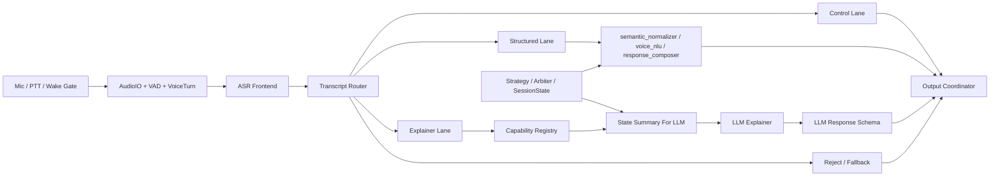

# 阶段三 LLM 解释旁路边界与接入计划

## 文档范围

本文档只定义：

- 阶段三语音模块中，**LLM 解释旁路**应如何接入
- 在什么边界下接入不会破坏现有实时主链
- 接入前必须先完成哪些路由、摘要、降级和协议工作
- 任务拆解和实施顺序

本文档**不**定义：

- LLM 直接参与策略决策
- LLM 直接接管控制命令
- LLM 直接替代 `FastIntentASR / StructuredQuerySchema / QueryRoute`
- 任意开放式聊天产品设计

---

## 一、结论

阶段三可以接入 LLM，但必须满足以下前提：

1. LLM 只能作为**解释旁路**
2. LLM 不进入实时策略主链
3. LLM 不进入控制命令主路径
4. LLM 只处理结构化主路径无法稳定覆盖的解释、总结和开放式追问
5. LLM 必须运行在明确的路由、能力边界、状态摘要和降级策略之后

正确目标是：

**让 Asurada 更像一个可追问、可解释的副驾。**

错误目标是：

**把 Asurada 改造成 `麦克风 -> LLM -> TTS` 的开放式聊天助手。**

### 当前实现进度

截至当前仓库状态，以下部分已经落地：

- `transcript_router`
- `capability_registry`
- `state_summary_for_llm`
- `llm_response_schema`
- `llm_explainer`
- `voice_sidecar_server`
- Doubao LLM sidecar 接入
- companion 模式下的 LLM 旁路

这意味着：

- explainer lane 已经不是纯设计稿
- companion lane 已经可运行
- LLM 解释旁路已经能通过 sidecar 提供真实回答

当前仍未完成的部分：

- AEC / 下行回声消除
- partial transcript 提前执行
- Pi 侧正式部署和恢复策略

---

## 二、为什么现在要先定边界

当前仓库已经具备：

- 统一输出主线
- `AudioIO / VAD / VoiceTurn`
- `FastIntentASR / voice_nlu / voice_input`
- `conversation_context / semantic_normalizer / response_composer`
- `open_fallback`

但当前还没有正式完成：

- `OpenASR` fallback
- `Transcript Arbiter`
- 设备侧麦克风闭环
- watchdog / 降级恢复

如果此时直接接入 LLM，而不先定义边界，会立刻出现四个问题：

1. 结构化 query、规则解释和 LLM 解释混在一起，来源不清
2. 高频状态查询被 LLM 抢走，延迟和不稳定性上升
3. 未接入的数据域被 LLM “补全”为看似合理但不可验证的回答
4. 后续 Pi 5 / CM5 部署时，LLM 成为系统刚性依赖，无法降级

因此，先定边界不是文档洁癖，而是为了避免后续返工。

---

## 三、LLM 在阶段三里的正确定位

LLM 只负责以下一类能力：

- 解释
- 总结
- 复杂自然表达的旁路理解
- 开放式追问的有限回答

LLM 不负责：

- 控制命令执行
- 高频状态查询
- 策略候选生成
- 仲裁
- 输出优先级决策

最准确的定位是：

**LLM 是 Voice Query 路由后的 explainer lane，不是 voice entry 的中心。**

---

## 四、推荐架构



关键点：

- 语音入口先形成统一 `VoiceTurn`
- 路由器先决定是否允许进入 LLM
- LLM 前面必须有 `Capability Registry` 和 `State Summary`
- LLM 输出必须经由结构化 schema 再进入现有输出主线

---

## 五、四条执行通道

### 1. Control Lane

适用：

- `停止`
- `取消`
- `重复`
- 后续可能扩展：
  - `简短点`
  - `详细一点`

要求：

- 永远不走 LLM
- 永远优先于其它 lane
- 必须保持低延迟、可预测

### 2. Structured Lane

适用：

- 燃油
- 前后车差距
- DRS / ERS
- 轮胎
- 车损
- 天气
- 处罚
- 进站状态

要求：

- 继续走现有主路径
- 不允许被 LLM 抢占
- 仍以规则化、结构化回答为主

### 3. Explainer Lane

适用：

- `为什么现在不进攻`
- `为什么现在偏向防守`
- `整体形势怎么样`
- `现在最优先该做什么，为什么`
- `如果等一圈再进站会怎样`
- 更自然的开放式追问

要求：

- 只在 control / structured 都不能稳定回答时进入
- 允许使用 LLM
- 但必须受能力边界和超时限制

### 4. Reject / Fallback Lane

适用：

- 无法归类
- 超出能力边界
- 安全性或可信度不足

要求：

- 明确拒答或提示当前支持范围
- 不假装理解

---

## 六、LLM 允许回答什么

建议允许进入 explainer lane 的问题分为三类。

### A. 解释型

- 为什么现在防守
- 为什么没有进攻
- 为什么当前策略是这样
- 为什么现在不进站

### B. 总结型

- 整体形势怎么样
- 现在最优先该做什么
- 当前最大风险是什么
- 接下来几圈最该注意什么

### C. 开放式追问型

- 那前车呢
- 这个风险多久会变严重
- 如果我继续不进站会怎样
- 这车损主要影响什么

---

## 七、LLM 永远不能碰什么

以下请求必须永远留在非 LLM 路径：

### A. 控制命令

- 停止
- 取消
- 重复
- 任何 barge-in / hard stop 指令

### B. 高频状态查询

- 后车差距
- 前车差距
- 当前 DRS / ERS
- 当前轮胎
- 当前天气
- 当前处罚
- 当前车损

### C. 策略执行和仲裁

- 不能让 LLM 改 `StrategyDecision`
- 不能让 LLM 改 `arbiter_v2`
- 不能让 LLM 直接决定是否播报主策略消息

### D. 未接入数据域

- 没有稳定数据链的领域，LLM 不能“推断式补全”

---

## 八、LLM 输入必须长什么样

LLM 不应直接看到全量原始状态对象。必须先做摘要。

建议新增：

- `state_summary_for_llm.py`

最小摘要内容：

- 当前圈数、位置、赛道、天气、赛道状态
- 当前主策略消息
- 前后车 gap、DRS、ERS、燃油、轮胎、车损的关键摘要
- 进站 / 处罚状态
- 当前最大风险
- 最近一次用户问题
- 最近一次系统主动播报
- 当前能力边界

目标：

- 控制 prompt 尺寸
- 提高稳定性
- 避免模型从不该看的原始字段里自由联想

---

## 九、LLM 输出必须长什么样

LLM 输出不能直接是一段自由文本。必须先约束成结构化 schema。

建议新增：

- `llm_response_schema.py`

最小字段建议：

```python
{
  "status": "answerable | needs_clarification | unsupported | unsafe",
  "answer_text": "...",
  "confidence": 0.0,
  "reason_fields": ["rear_gap", "primary_message", "tyre_status"],
  "requires_confirmation": false
}
```

这样做的目的：

- 让输出可验证
- 让失败和拒答可显式表达
- 让结果仍能进入现有 `SpeechJob -> OutputCoordinator` 主线

---

## 十、必须先做的边界模块

在接入任何 LLM 之前，建议先补这四个模块。

### 1. `transcript_router.py`

职责：

- 接收 `VoiceTurn`
- 路由到：
  - `control`
  - `structured`
  - `explainer`
  - `reject`

这是 LLM 接入前的第一道边界。

### 2. `capability_registry.py`

职责：

- 定义当前支持域
- 定义禁止域
- 定义哪些 query kind 可进入 explainer lane

这是防止模型乱答的第二道边界。

### 3. `state_summary_for_llm.py`

职责：

- 生成稳定、受控、低噪声的状态摘要

这是控制 prompt 和解释质量的第三道边界。

### 4. `llm_response_schema.py`

职责：

- 约束模型输出
- 把自由文本变成受控的答复协议

这是输出可验证性的第四道边界。

---

## 十一、推荐实施顺序

### Phase 0：文档和边界冻结

交付：

- 本文档

完成标准：

- 团队明确 LLM 只做解释旁路
- 允许域 / 禁止域清晰

### Phase 1：路由骨架

交付：

- `transcript_router.py`
- `capability_registry.py`

完成标准：

- 不接 LLM 时，系统也能完成 `control / structured / reject` 路由
- `explainer` 路径先可打桩

### Phase 2：状态摘要与输出 schema

交付：

- `state_summary_for_llm.py`
- `llm_response_schema.py`

完成标准：

- 能对同一个问题稳定生成摘要输入
- 模型输出协议固定

### Phase 3：规则化 explainer lane

交付：

- 先不用 LLM
- 用现有 `response_composer` 先模拟 explainer lane

完成标准：

- 路由逻辑跑通
- 结构化 lane 不回归
- explainer lane 可以单独测试

### Phase 4：接入真实 LLM

交付：

- `llm_explainer.py`

完成标准：

- 只处理 explainer lane
- 有超时
- 有失败降级
- 不阻塞主链

### Phase 5：回归和灰度

交付：

- 路由回归
- 降级回归
- 结构化不回归
- explainer 命中和拒答回归

完成标准：

- 控制命令稳定
- 高频结构化 query 不被 LLM 污染
- LLM 失败时系统仍然可用

---

## 十二、能做到什么

按上述方案接入后，Asurada 可以获得这些收益：

- 更自然的追问体验
- 更像副驾的总结能力
- 更好的“为什么”解释能力
- 更少固定句式依赖
- 更少 `open_fallback` 的机械拒答

用户主观感受上会更像：

- 会持续对话的副驾
- 能解释决策的助手

而不是：

- 固定菜单式问答器

---

## 十三、不能做到什么

即使接了 LLM，也不应该声称系统能做到这些：

- 任意开放式聊天
- 直接做策略规划
- 直接决定进攻 / 防守 / 进站
- 对未来几圈做高置信预测
- 对未接入数据域给出可信答案

也就是说：

**LLM 会让 Asurada 更会解释，不会让它自动变成主控策略脑。**

---

## 十四、可能出现的问题

### 1. 路由冲突

同一句话可能既像结构化查询，又像解释请求。

解决：

- 明确优先级：
  - `control > structured > explainer > reject`

### 2. 幻觉

LLM 对未接入数据域给出“听起来像真的”答案。

解决：

- `capability_registry`
- `unsupported`
- `unsafe`
- 明确拒答

### 3. 延迟

解释类请求耗时明显高于结构化请求。

解决：

- 只在 explainer lane 使用
- 设超时
- 超时回退规则解释 / open fallback

### 4. Pi 侧不可部署

开发机效果好，但正式设备负载不行。

解决：

- 让 LLM 保持可选旁路
- 不作为设备主路径刚性依赖

### 5. 用户预期过高

用户会误以为系统“什么都懂”。

解决：

- 保持能力边界公开
- 回答里允许说“当前不支持完整解释”

---

## 十五、与最开始阶段三语音设计的偏差

这条方案和最初设计总体一致，但有三个偏差需要明确记录。

### 偏差 1：会话层权重变高

最初设计重点在：

- 结构化 query
- 设备侧闭环

接 LLM 后，会话管理和路由层会变成核心模块。

### 偏差 2：解释层从辅助项变成正式 lane

最初设计里，解释层更偏旁路辅助。  
接 LLM 后，解释会成为正式产品能力之一。

### 偏差 3：`OpenASR` 和 explainer lane 耦合度提高

最初设计里：

- `OpenASR` 只是 fallback

接 LLM 后：

- `OpenASR` 的输出更可能流向 explainer lane

这意味着：

- transcript 路由和 fallback 策略要更早定型

---

## 十六、当前建议

现在不建议直接实现 LLM 调用。  
最合理的下一步是：

1. 先补 `transcript_router.py`
2. 先补 `capability_registry.py`
3. 先补 `state_summary_for_llm.py`
4. 先补 `llm_response_schema.py`

等这四个边界模块收口后，再接任何 LLM，返工都最小。

---

## 十七、结论

“先定边界再接 LLM” 是阶段三里唯一合理的 LLM 接入方式。

正确路径是：

**先做路由、能力边界、状态摘要和输出 schema，再让 LLM 进入 explainer lane。**

不是：

**先接一个模型，再回头修系统边界。**

---

## 附录 A：当前代码状态

当前仓库已经具备以下实现：

- `control / structured / explainer / reject` 四路显式路由
- `capability_registry.py` 定义允许域和禁止域
- `state_summary_for_llm.py` 生成稳定摘要
- `llm_response_schema.py` 校验 sidecar 返回
- `llm_explainer.py` 已接到 `voice_input.py`
- `explainer lane` 在 sidecar 成功时可覆盖规则化回答
- sidecar 失败、超时、`unsupported` 时自动回退到现有 core 回答

当前默认仍关闭，不会改变现有结构化主路径。

## 附录 B：当前 backend 与开关

### 0. 当前主用 backend：`voice_sidecar`

适合：

- 当前开发机主链
- `explainer` / `companion` 统一走 sidecar
- 与 Doubao LLM / TTS / realtime ASR 共用一条 sidecar 入口

环境变量：

- `ASURADA_LLM_SIDECAR_ENABLED=1`
- `ASURADA_LLM_SIDECAR_BACKEND=voice_sidecar`
- `ASURADA_VOICE_SIDECAR_BASE_URL=http://127.0.0.1:8788`
- `ASURADA_LLM_SIDECAR_TIMEOUT_MS=1800`

说明：

- 当前运行中的主路径优先使用这一项
- `voice_sidecar_server.py` 内部可继续挂 Doubao provider
- sidecar 失败、超时、`unsupported` 时仍自动回退 core

### 1. `command` backend

适合：

- 本地 stub
- 任意外部脚本
- 先跑通 sidecar 协议，不急着接真实模型

环境变量：

- `ASURADA_LLM_SIDECAR_ENABLED=1`
- `ASURADA_LLM_SIDECAR_BACKEND=command`
- `ASURADA_LLM_SIDECAR_COMMAND="<command ...>"`
- `ASURADA_LLM_SIDECAR_TIMEOUT_MS=1800`

要求：

- 进程从 `stdin` 读取一条 `LlmExplainerRequest` JSON
- `stdout` 输出一条符合 `llm_response_schema.py` 的 JSON

仓库内 stub：

- [phase3_llm_sidecar_stub.py](/Users/sn5/Asurada/asurada-core/scripts/phase3_llm_sidecar_stub.py)

### 2. `openai` backend

适合：

- 后面挂真实 OpenAI Responses API
- 但当前仍建议默认关闭

环境变量：

- `ASURADA_LLM_SIDECAR_ENABLED=1`
- `ASURADA_LLM_SIDECAR_BACKEND=openai`
- `OPENAI_API_KEY=...` 或 `ASURADA_OPENAI_API_KEY=...`
- `ASURADA_OPENAI_MODEL=gpt-5.2-mini`
- `ASURADA_OPENAI_BASE_URL=https://api.openai.com/v1`
- `ASURADA_LLM_SIDECAR_TIMEOUT_MS=1800`
- 可选：
  - `OPENAI_ORGANIZATION`
  - `OPENAI_PROJECT`

说明：

- 当前实现使用 Responses API
- 当前只挂在 `explainer lane`
- 默认仍不自动启用

## 附录 C：本地 smoke

### 1. command stub smoke

```bash
cd /Users/sn5/Asurada
export ASURADA_LLM_SIDECAR_ENABLED=1
export ASURADA_LLM_SIDECAR_BACKEND=command
export ASURADA_LLM_SIDECAR_COMMAND="/usr/bin/python3 /Users/sn5/Asurada/asurada-core/scripts/phase3_llm_sidecar_stub.py"
PYTHONPATH=asurada-core/src python3 asurada-core/scripts/phase3_macos_voice_loop.py --enable-llm-sidecar
```

建议测试：

- `整体形势怎么样`
- `为什么现在不进攻`
- `后车差距`

预期：

- 前两句进入 `explainer lane`
- `后车差距` 继续走 `structured lane`

### 2. 回归

```bash
cd /Users/sn5/Asurada
PYTHONPATH=asurada-core/src python3 asurada-core/scripts/phase3_transcript_router_regression.py
PYTHONPATH=asurada-core/src python3 asurada-core/scripts/phase3_llm_boundary_regression.py
PYTHONPATH=asurada-core/src python3 asurada-core/scripts/phase3_llm_explainer_regression.py
PYTHONPATH=asurada-core/src python3 asurada-core/scripts/phase3_llm_sidecar_integration_regression.py
PYTHONPATH=asurada-core/src python3 asurada-core/scripts/phase3_llm_command_backend_regression.py
PYTHONPATH=asurada-core/src python3 asurada-core/scripts/phase3_openai_llm_backend_regression.py
```
