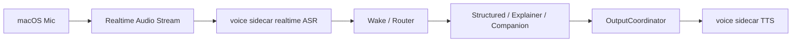
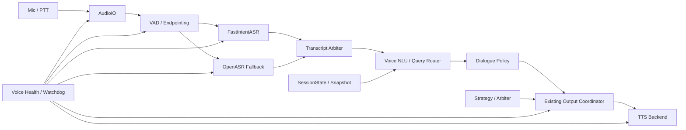

# 阶段三语音模块架构

## 文档范围

本文档只定义**阶段三语音模块**，不覆盖整个阶段三。

不在本文档范围内的内容：

- UDP 解码主链
- 策略引擎本体
- 模型训练与标签体系
- HUD 全量产品设计
- 设备整机电源 / 散热 / 结构设计

本文档只回答以下问题：

- 树莓派正式部署时，语音模块应如何分层
- 现有单向语音输出主线如何复用
- 双向语音应如何拆成 ASR / VAD / TTS / 路由等模块
- 哪些能力必须本地运行
- 语音模块的正式降级与恢复策略是什么

---

## 一、设计前提

阶段三语音模块在最终 Pi / CM5 产品形态下必须满足以下约束：

- 最终部署环境是 `Pi 5 / CM5`
- 主路径不依赖外网
- 赛道噪声环境下必须可控
- 输入链不能拖垮策略主链
- 输出链必须复用当前统一下行语音主线
- 支持后续扩展，但首发范围必须受控

当前仓库已经具备的语音基础：

- 统一下行语音任务模型 `SpeechJob`
- 统一输出协调器 `ConsoleVoiceOutput`
- 真实开发机 TTS backend `MacOSSayBackend`
- `AudioIO / VAD / VoiceTurn` 输入基础模块
- `FastIntentASR / voice_nlu / voice_input` 结构化输入骨架
- `conversation_context / semantic_normalizer / response_composer` 语义归一化、短上下文记忆与规则化解释层
- `open_fallback` 与更广结构化问法
- `PiperBackend` 设备侧 TTS backend 代码路径
- `1 active + 1 pending` 输出队列
- `enqueue / replace_pending / complete` 生命周期
- 系统主动播报与结构化查询响应共路径
- `voice sidecar` 协议与本地 server
- Doubao LLM / streaming TTS / realtime ASR
- macOS realtime `voice loop`
- partial transcript preview、提前 arm 与 `companion` 模式

因此阶段三不应重写输出层。当前开发机已经有一条可运行的 sidecar 实现；下一步重点是补齐 AEC / 串音抑制、local ASR fallback、watchdog 与 Pi 真机验证。

---

## 二、总体原则

阶段三语音模块采用以下原则：

1. Pi 正式形态本地优先
2. 结构化快路径优先
3. 开放式识别只做 fallback
4. 控制面和媒体面分离
5. 输出继续复用现有统一语音主线
6. 所有关键路径都必须支持降级

不推荐的方案：

- `麦克风 -> 通用 ASR -> LLM -> TTS` 单链路
- 首发即纯 wake word
- 全部走开放式自由语音
- 把 HTTP 微服务作为 Pi 正式主路径的唯一依赖

说明：

- 当前开发机实现已经采用本机 `voice sidecar` 的 HTTP / WS 桥接
- 这条链是当前验证路径，不等于最终 Pi 正式主路径

---

## 三、当前开发机实现与最终推荐架构

### 1. 当前开发机实现



当前特征：

- realtime ASR 已默认接入
- LLM / TTS / ASR 当前通过 Doubao sidecar 跑通
- `companion` 模式已可运行
- 这条链用于开发机验证，不代表 Pi 最终部署形态

### 2. 最终 Pi 推荐架构



这张图有两个关键点：

- 输入是新增模块
- 输出继续复用现有 `SpeechJob -> OutputCoordinator -> TTS backend`

---

## 四、模块拆分

### 1. AudioIO

职责：

- 麦克风采集
- 扬声器输出设备管理
- 采样率统一
- 输入增益和静音控制

正式部署要求：

- Linux/ALSA backend
- 输入统一为 `16kHz mono PCM`
- 输出设备独立可配置

开发机可保留：

- macOS backend

说明：

- 设备切换和平台差异应封装在这一层
- 不要让 ASR/TTS 直接控制底层音频设备

### 2. Activation

职责：

- 决定何时允许开始语音输入

当前开发机默认：

- 连续监听 + wake phrase

Pi 首发建议：

- `PTT` 优先，wake word 作为补充

不建议首发即上纯 wake word，原因：

- 赛道噪声大
- 当前系统已有主动播报，回声会显著提高误触发概率
- 控制命令误触发成本高

后续可选：

- wake word 作为补充模式，而不是第一阶段主路径

### 3. VAD / Endpointing

职责：

- 判断说话开始
- 判断说话结束
- 形成完整语音 turn
- 为后续 barge-in 提供边界信号

推荐：

- `Silero VAD + ONNX Runtime`

选择理由：

- CPU 成本低
- ARM/Linux 可部署
- 流式切分成熟
- 能在树莓派本地运行

### 4. FastIntentASR

职责：

- 识别高频、结构化、强时效语音

首发范围建议固定为：

- `fuel_status`
- `rear_gap`
- `tyre_status`
- `current_strategy`
- `repeat_last`
- `stop`
- `cancel`

设计原则：

- 不追求开放式听写
- 直接输出结构化意图和槽位
- 直接对齐当前 `StructuredQuerySchema`

实现建议：

- 受限短语词表
- alias / 同义短语映射
- 受限 grammar 或 phrase-ranking

当前开发机里，这条链已经被 sidecar realtime ASR 暂时替代；它更适合作为 Pi / 本地降级路径。

### 5. OpenASR

职责：

- 处理 `FastIntentASR` 未命中的输入
- 处理更自然表达
- 为解释型旁路预留入口

推荐：

- `whisper.cpp`

原因：

- C/C++
- ARM NEON 友好
- CPU-only 可运行
- macOS / Linux / ARM64 路径统一

定位：

- Pi / 离线 fallback
- 非当前开发机主路径

### 6. Transcript Arbiter

职责：

- 决定当前 turn 使用哪条识别结果

推荐策略：

1. `FastIntentASR` 高置信命中，直接采用
2. 否则进入 `OpenASR`
3. `OpenASR` 输出再做 normalization
4. 如果仍不能路由到结构化 query，则进入解释型旁路或拒答

### 7. Voice NLU / Query Router

职责：

- 把识别结果映射到现有交互协议

复用当前已有结构：

- `InteractionInputEvent`
- `StructuredQuerySchema`
- `QueryRoute`
- `ConfirmationPolicy`
- `TaskHandle`

要求：

- 不允许为语音输入另起第二套 query 协议

### 8. Dialogue Policy

职责：

- 确认是否需要执行
- 是否需要确认
- 是否允许只 HUD 不语音
- 是否需要“请再说一次”
- 是否允许 stop / cancel / repeat 立刻生效

建议：

- 继续扩展现有 `confirmation_policy / task_lifecycle / output_lifecycle`
- 不要新建独立语音策略协议

### 9. Output Coordinator

职责：

- 统一系统主动播报与查询响应输出

正式要求：

- 保持现有 `SpeechJob` 和 lifecycle 协议
- 不重做输出语义

当前可直接复用：

- `1 active + 1 pending`
- `enqueue / replace_pending / complete`
- active 不打断、pending 可替换

### 10. TTS Backend

正式设备侧推荐：

- `PiperBackend`

开发机验证保留：

- `MacOSSayBackend`

正式要求：

- TTS backend 必须是可替换的
- 正式部署时不再依赖桌面环境

### 11. Voice Health / Watchdog

职责：

- 音频输入状态监控
- ASR worker 心跳
- TTS worker 心跳
- 队列卡死检测
- 自动重启
- 自动降级

这不是附属模块，是正式部署必需模块。

---

## 五、正式部署形态

推荐：

**单机多进程 + 本地 IPC**

不推荐：

- 把本机 HTTP 微服务作为 Pi 正式主路径的唯一通信方式

建议进程：

- `asurada-core`
- `asurada-audio`
- `asurada-asr-fast`
- `asurada-asr-open`
- `asurada-tts`
- `asurada-watchdog`

建议 IPC：

- 本地 Unix domain socket
- 控制消息用 JSON
- 音频数据按 turn 边界传递，不做全链路 HTTP 化

原因：

- 本机部署下 HTTP 只增加复杂度
- 进程隔离能提升稳定性
- 树莓派上更容易做自动重启和资源隔离

---

## 六、输入与输出的正式数据流

### 1. 系统主动播报

```text
strategy -> arbiter -> SpeechJob -> OutputCoordinator -> TTS backend
```

这条链当前已存在，不应重写。

### 2. 结构化语音查询

```text
PTT -> AudioIO -> VAD -> FastIntentASR -> InteractionInputEvent
-> StructuredQuerySchema -> QueryRoute -> snapshot answer
-> SpeechJob -> OutputCoordinator -> TTS backend
```

这是 Pi 正式首发必须打通的链路。当前开发机已先走 sidecar realtime ASR 验证链。

### 3. 开放式 fallback

```text
PTT -> AudioIO -> VAD -> OpenASR -> normalization
-> structured route or explanation sidecar
-> SpeechJob -> OutputCoordinator -> TTS backend
```

这条链当前已由 LLM sidecar 在开发机环境跑通，但本地 fallback 仍需在 Pi 路线里补齐。

---

## 七、中断与优先级策略

当前输出层规则已确定：

- active 不打断
- pending 可替换

阶段三输入侧建议如下：

### 默认规则

- 用户语音不默认硬切 active TTS
- active TTS 播完后再处理新输入

### 特殊控制命令

允许以下命令触发 hard stop：

- `停止`
- `取消`
- `重复`

原因：

- 这是低风险、高收益的最小 barge-in 范围
- 其它普通查询不应直接打断当前主动播报

---

## 八、正式降级策略

### 情况 1：realtime ASR 异常

- 禁用 realtime 语音输入
- 保留系统主动播报
- 若本地 fallback 可用，则切到本地 fallback

### 情况 2：local fallback 异常

- 保留当前主路径
- 禁用本地 fallback

### 情况 3：TTS 异常

- 禁用语音输出
- 保留 HUD / 日志 / 控制台

### 情况 4：Audio capture 异常

- 禁用语音输入
- 保留系统主动播报

### 情况 5：Watchdog 检测到 worker 卡死

- 先局部重启 worker
- 重启失败则进入语音降级模式
- 不允许拖死 `asurada-core`

---

## 九、推荐技术栈

### 正式首发推荐

- `AudioIO`
  - Linux audio backend
- `VAD`
  - `Silero VAD`
- `FastIntentASR`
  - 受限短语 / grammar / phrase-ranking
- `OpenASR`
  - `whisper.cpp`
- `TTS`
  - `Piper`
- `Model runtime`
  - `ONNX Runtime` 用于 VAD 与部分轻量推理

### 原则

- 树莓派主路径尽量只保留 CPU 友好栈
- 不依赖网络
- 不依赖闭源云服务

---

## 十、为什么这是推荐架构

原因不是“功能最多”，而是它最符合当前项目边界：

- 你已经有统一输出主线
- 你未来要落在树莓派
- 你需要低延迟和可降级
- 你当前的主要需求是结构化副驾问答，而不是开放式聊天

因此最佳路径是：

- 用结构化快路径解决高频需求
- 用开放式 fallback 解决扩展性
- 保持输出协议不变
- 把平台差异封装在 backend 和 worker 层

---

## 十一、结论

阶段三语音模块的正式推荐架构是：

**树莓派本地一体化 + 结构化快路径 + whisper fallback + Piper TTS + 统一输出协调器 + 多进程媒体执行**

这条路线能最大程度复用当前已经完成的输出主线，同时把后续树莓派部署、双向语音扩展和降级控制纳入同一套工程边界。
